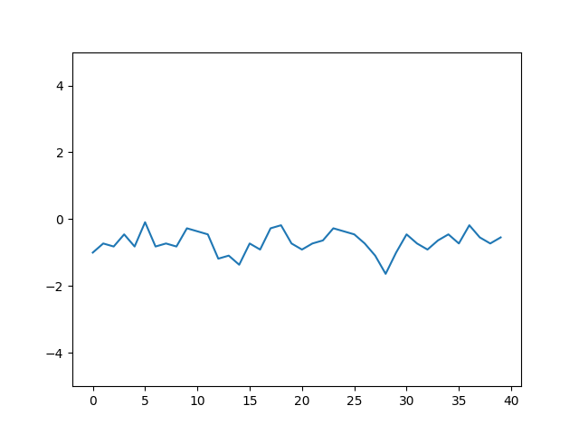

# PocMan

## 0 - Introduction  

La seconde partie du module Info215 se concentre sur l'apprentissage par renforcement, qui, à la différence de l'apprentissage supervisé, nous permet de créer un agent conscient du monde dans lequel il évolue, sans connaitre de stratégies a priori. Ce système d'intelligence artificielle convient parfaitement dans le cadre du développement d'un jeu vidéo.
Ainsi, comme proposé par le sujet, nous allons écrire un algorithme d'apprentissage par renforcement ayant pour but de maitriser un jeu PacMan sans connaissances autres que l'environnement.

On commence donc par développer l'implémentation de l'intelligence artificielle, puis l'agrégation et l'analyse des données issues de la simulation.

## 1 - Implémentation de l'intelligence artificielle  

La majeure partie de l'implémentation se fait dans une classe `QLearn`. L'objectif de cette classe est de déterminer la meilleure action à effectuer par l'agent (ici PacMan) en fonction de son environnement.  
On adopte une stratégie ε-greedy : avec une probabilité ε, on choisit la meilleure action à effectuer (et une action au hasard dans l'autre cas). On fait de plus évoluer ε en fonction de l'age du monde à l'aide d'une fonction particulière (on peut la considérer comme un hyperparamètre) : 
\\[x \to \sigma \left( \frac{ln \left ( x\right )}{2} - 6\right )\\]  

On choisit d'implémenter deux méthodes de mise-à-jour de la fonction Q (l'estimateur de la meilleure action) :

  - Q-Learning implémentée dans `void learn(int st, int at, int st1, double r)`
  - SARSA implémentée dans `void learn(int st, int at, int st1, int at1, double r)`

Dans les deux cas, on construit un objet `HashMap` qui, à chaque environnement associe une `ArrayList` de probabilités associées a chaque action possible.

Enfin, pour utiliser les données accumulées, on implémente un mécanisme de choix de la meilleure action dans `Tuple<Integer, Double> bestAction(int state)`. Cela revient à coder une fonction maximum, avec les particularités de parcourir une `HashMap`, ainsi que d'avoir des données négatives.

## 2 - Résultats de simulation  

### A - Support

Afin d'analyser le processus d'apprentissage, nous mettons en place un système de sauvegarde des variables représentatives de chaque simulation dans un fichier. On exploite ensuite ces fichiers à l'aide d'un script écrit en Python : ce dernier permet de convertir les chiffres bruts en graphiques dans le format PNG. Nous visualisons les données à l'aide de la bibliothèque Matplotlib.
On ajoute la possibilité de réduire le bruit des données, afin de lisser le rendu graphique. Pour ce faire, on calcule la moyenne glissante sur le jeu de données que l'on a recueilli, finalement c'est celle-ci que l'on trace.  

   Avant                        |  Après
   :---------------------------:|:------------------------:
   |

### B - Paramètres

Nous avons fait le choix de faire jouer dix millions de parties à notre programme et sauver les indicateurs toutes les cinq mille parties.
Nous choisissons de plus de modifier les récompenses données pour réduire l'ampleur des nombres manipulés par le programme :

```java
private double r_ghost = -20;
private double r_food  = 10;
private double r_stuck = -5;
private double r_nothing = -1;
```

### C - Données
Pour contrôler le progrès de l'apprentissage, nous avons donc recueilli le nombre de morts, de récompenses et de murs rencontrés, on peut alors tracer un graphique des trois grandeurs en fonction du nombre de parties.

On obtient les graphiques suivants :  

  

### D - Analyse

Dans le premier cas, on remarque premièrement l'ampleur des parties perdues et des murs rencontrés face au nombre de nourriture gagnées, de plus, il n'y a que relativement peu de fluctuations autour d'une même valeur.
Dans les cas où l'on utilise l'apprentissage par renforcement, on voit très clairement que le nombre de morts et de murs rencontrés décroit fortement, alors que le nombre de nourritures perçues augmente. On en conclut que l'apprentissage est (très) efficace par rapport a une marche aléatoire.
De plus, il existe une différence notable entre les méthodes SARSA et Q-Learning, la dernière se montre plus efficace (elle converge vers 40 morts par époque contrairement à 60 pour SASRA, On obtient aussi de meilleurs scores pour les autres indicateurs).

## 3 - Conclusion

Nous avons finalement implanté un algorithme d'apprentissage par renforcement permettant à PacMan de tromper les fantômes sans savoir a priori comment les éviter.
